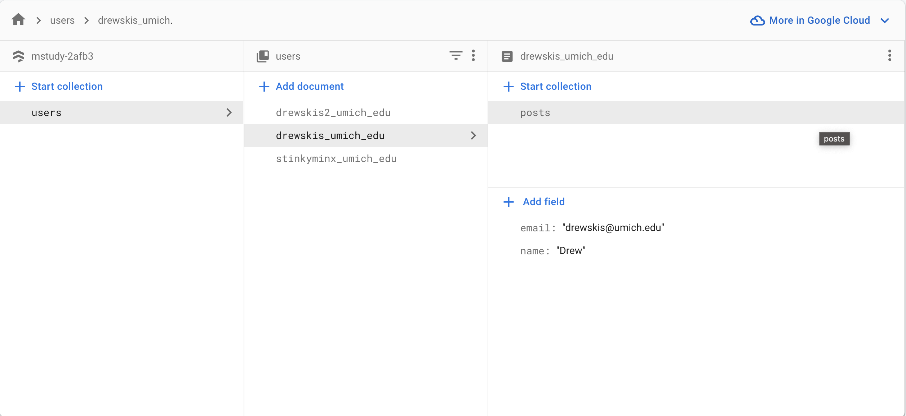
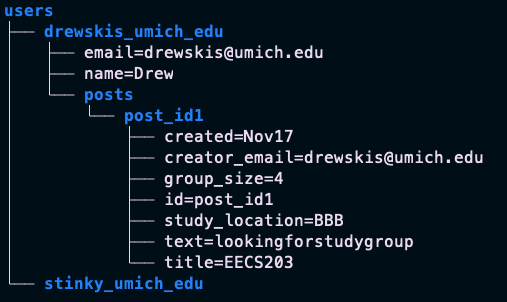

# MStudy - Database Managers

This document describes the interface that we can use to store and retrieve information from our firebase database.

## 1. Overview

Our app, **MStudy**, makes heavy use of Google's Firebase package in our project. Firebase drastically simplifies the process of authenticating users, storing data, and publishing files on behalf of app users. And all for free! 

Because we don't have enough time in the semester to all learn all the funky syntax of how firebase stores data, I wrote some simple function wrappers to make the process of retrieving and storing information from the firebase database much simpler. Feel free to take a look at the code! Feel free to use it as a starting point for any personal projects of yours.

## 2. Database Structure
<p align="center">
  
</p>

Our database structure is fairly simple. You can think of it as the following file structure: 
<p align="center">
  
</p>

In this image, the white represent some actual text field (key-value pair) and the blue represents a collection (sort of like a folder). The important thing to notice is that 
1. each user is uniquely identified by their email address 
2. each user has a collection of their own posts

## 3. Functions
The following are functions that you can use in code to interact with the firebase database. All of which are defined in the DatabaseManager.swift class in our project. Every function can be called like 
```swift
DatabaseManager.shared.function_name(arguments...)
```

### 3.1 `insert(post: Post, email: String, completion: @escaping(Bool)->Void)`

The funtion, `insert`, can be used to publish a post from a specific user. This function requires two things: a post object, and the email of the user that is making the post. 

Example Code: 

```swift
// Create a post object
let post = Post(email: email, text: text, ...) 
//Get the user's cached email
let email = UserDefaults.standard.string(forKey: "email")

//Make a post
DatabaseManager.shared.insert(post, email) {success in
    if success:
        print("Successfully made a post!")
    else:
        print("Failed to make a post!")
}
```

### 3.2 `getAllPosts(completion: @escaping([Post])->Void)`

The funtion, `getAllPosts`, can be used to acquire every post on the firebase database. This function takes no arguments and returns a list of posts.

Example Code: 

```swift
//Query all posts...
var my_posts: [Post] = []
DatabaseManager.shared.getAllPosts() { posts in
    print("Recieved \(posts.count) posts!")
    my_posts = posts
}
```

### 3.3 `getPosts(for email: String, completion: @escaping([Post])->Void)`

The funtion, `getPosts`, can be used to acquire the post for a specific user on the firebase database. This function takes the email of a specific user as an argument.

Example Code: 

```swift
//Get the user's email somehow...
let email = UserDefaults.standard.string(forKey: "email")

//Query posts of this user...
var my_posts: [Post] = []
DatabaseManager.shared.getPosts(for: email) {posts in
    print("Recieved \(posts.count) posts!")
    my_posts = posts
}
```

### 3.4 `getUser(email: String, completion: @escaping (User?) -> Void)`

The funtion, `getUser`, can be used to get a user's information given their email address.

Example Code: 

```swift
//Get the user's email somehow...
let email = UserDefaults.standard.string(forKey: "email")

//Get the user
var my_user : User?
DatabaseManager.shared.getUser(email: email) { user in
    guard let user = user else{
        print("Could not find user")
        return
    }

    my_user = user
}
```